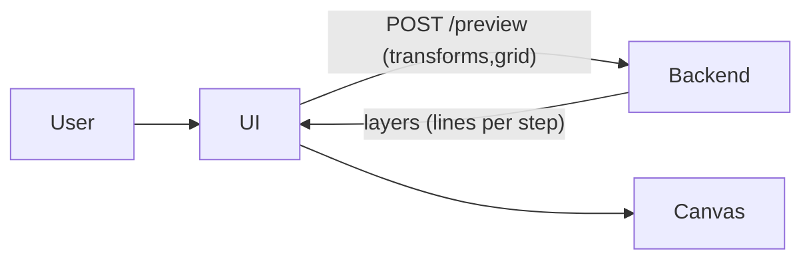

## Remember

- Exact file paths always
- Exact commands with expected output
- DRY, YAGNI, TDD, frequent commits

## Plan assets

- Create and use: `docs/plans/2026-02-28_desmos_matrix_app_482193/`
- UI screenshots:
  - Before: `docs/plans/2026-02-28_desmos_matrix_app_482193/images/before/`
  - After: `docs/plans/2026-02-28_desmos_matrix_app_482193/images/after/`

## Overview

We’ll scaffold a new monorepo-style project inside your empty `matrix_desmos/` repo, with a Desmos-like split UI (left: stacked 2x2 transforms; right: interactive plane) and a Python FastAPI backend that composes transforms and returns **intermediate-step transformed grid layers** so the UI can render each step as a distinct colored overlay while supporting smooth pan/zoom.

## Happy Flow

1. User opens the UI at `[app/ui](app/ui)` and sees a split layout: transform stack panel + graph canvas.
2. UI state in `app/ui/src/lib/state.ts` holds `grid` settings and an ordered list of transforms (`a,b,c,d`, enabled).
3. When the user edits a matrix, reorders, adds/removes, or toggles transforms, `app/ui/src/lib/api.ts` debounces a request to the backend `POST http://localhost:8000/preview`.
4. Backend endpoint implemented in `[app/backend/src/matrix_backend/main.py](app/backend/src/matrix_backend/main.py)` validates input (Pydantic), then calls pure compute functions in `[app/backend/src/matrix_backend/compute.py](app/backend/src/matrix_backend/compute.py)`:
  - Compose prefix matrices for each enabled transform (intermediate steps).
  - Generate base grid line segments in world coordinates.
  - Apply each prefix matrix to the base segments and return layers.
5. UI receives `{ layers: [...] }` and `app/ui/src/components/GraphCanvas.tsx` renders:
  - Base grid (gray)
  - Layer 1..N as colored overlays (one color per intermediate step)
  - Axes and an optional unit square / basis vectors
6. User pans/zooms on canvas; only the view transform changes (no backend call).

## API + data contracts

- **Request** (`POST /preview`)
  - `grid.extent: float` (e.g. 10)
  - `grid.step: float` (e.g. 1)
  - `transforms: [{ a: float, b: float, c: float, d: float, enabled?: bool }]` (ordered)
- **Response**
  - `layers: [{ index: int, matrix: [[a,b],[c,d]], lines: [[x1,y1,x2,y2], ...] }]`
  - (UI chooses colors; backend stays deterministic)

## Key implementation details

- **Transform order**: apply in list order so a point transforms as x' = T_k \cdot ... \cdot T_2 \cdot T_1 \cdot x. Layer `i` is prefix composition up to transform `i`.
- **Grid representation**: for each integer `x` and `y` in `[-extent, extent]` at `step`, represent each grid line as a single segment with endpoints; linear transforms preserve lines.
- **Interactivity**:
  - Canvas uses a simple camera: `scale`, `tx`, `ty` with wheel-zoom around mouse and pointer-drag pan.
  - Backend calls are debounced and cancellable (AbortController) to stay responsive.

## Alternative approaches (not chosen)

- **All math in browser**: lowest latency and simplest deployment; not chosen because you selected a Python API compute path.
- **Pyodide in-browser Python**: keeps “Python math” without server roundtrips; not chosen because it adds bundle weight and complexity.
- **SVG instead of canvas**: easier DOM layering but can get slow with many segments; canvas is simpler and fast enough here.
- **WebSocket streaming**: unnecessary for 2x2 + small grids; HTTP POST + debounce is simpler.

## Manual Verification

- **Backend (Python)**:
  - `cd app/backend`
  - `uv sync` (expected: creates/updates `.venv`, installs deps)
  - `uv run pytest -q` (expected: all tests pass)
  - `uv run uvicorn matrix_backend.main:app --reload --port 8000`
  - `curl -s http://localhost:8000/health` (expected: `{"ok":true}`)
  - `curl -s -X POST http://localhost:8000/preview -H 'content-type: application/json' -d '{"grid":{"extent":2,"step":1},"transforms":[{"a":1,"b":0,"c":0,"d":1}]}'` (expected: JSON with `layers[0].lines` non-empty)
- **UI (Next.js)**:
  - `cd app/ui`
  - `pnpm install`
  - `pnpm dev` (expected: dev server on `http://localhost:3000`)
  - Open `http://localhost:3000` and verify:
    - Left panel: add/remove/reorder transforms; edit matrix entries.
    - Right canvas: base grid visible; each intermediate step renders as distinct color overlay.
    - Pan: drag on canvas moves view.
    - Zoom: mouse wheel zooms around cursor.
    - Toggling a transform updates overlays after a short debounce.

## Implementation todos

1. **before-screenshots**: Create `docs/plans/2026-02-28_desmos_matrix_app_482193/` and capture baseline UI screenshots to `.../images/before/` (initial scaffold page before matrix features).
2. **repo-layout**: Create folders `app/ui/` and `app/backend/` at repo root and add minimal root docs (`README.md`) describing how to run both.
3. **backend-tests-first**: In `app/backend/`, set up `pyproject.toml` (uv) + `src/` layout and write `tests/test_compute.py` covering:
  - matrix composition order
  - identity transform leaves grid unchanged
  - a simple scale/rotation produces expected endpoints
4. **backend-implementation**: Implement `matrix_backend/compute.py`, `matrix_backend/schemas.py`, and `matrix_backend/main.py` with `/health` and `/preview`.
5. **backend-cors**: Add CORS middleware in `matrix_backend/main.py` for `http://localhost:3000`.
6. **ui-scaffold**: Scaffold Next.js app into `app/ui/` with Tailwind, App Router, TypeScript, and ESLint.
7. **ui-state-and-api**: Add `app/ui/src/lib/state.ts` (transform stack + grid settings) and `app/ui/src/lib/api.ts` (debounced fetch + abort).
8. **ui-transform-editor**: Build components:
  - `app/ui/src/components/TransformList.tsx`
  - `app/ui/src/components/TransformCard.tsx`
  - `app/ui/src/components/MatrixInput.tsx`
  - Reorder via up/down buttons (keep it simple; no drag-drop initially)
9. **ui-canvas-renderer**: Build `app/ui/src/components/GraphCanvas.tsx`:
  - draw base grid, axes, and layer overlays
  - implement pan/zoom camera
  - legend showing layer colors mapped to transform names
10. **ui-polish**: Add a couple presets (Identity, Scale, Rotate θ) as buttons in `TransformCard` (still emitting explicit 2x2 values).
11. **after-screenshots**: Capture updated happy-flow screenshots to `docs/plans/2026-02-28_desmos_matrix_app_482193/images/after/`.

## Notes on file paths we’ll create

- UI (Next.js):
  - `app/ui/package.json`
  - `app/ui/next.config.js`
  - `app/ui/src/app/page.tsx`
  - `app/ui/src/components/`*
  - `app/ui/src/lib/`*
- Backend (Python):
  - `app/backend/pyproject.toml`
  - `app/backend/src/matrix_backend/main.py`
  - `app/backend/src/matrix_backend/compute.py`
  - `app/backend/src/matrix_backend/schemas.py`
  - `app/backend/tests/test_compute.py`

